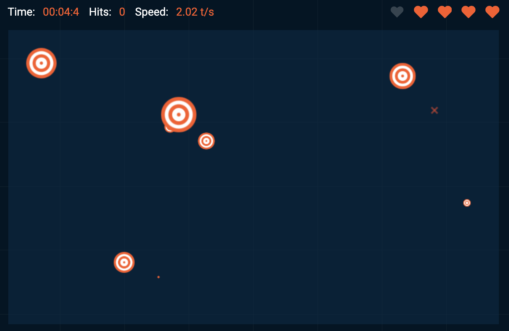

# PythonProjects

## Overview

Welcome to the iOS Mini-Games Repository. This collection of mini-games showcases popular games built using SwiftUI. Each game within this repository incorporates different aspects of iOS development with SwiftUI.

This repository contains a collection of small python project utilizing various librarys to complete the intended function.
### Programs Included

- **Clicker**: A program that clicks on a target from an online game whenever the target is on screen. The goal of the program was to test how efficent the program could be. This was measured based upon the score the program would recieve from the game that increased in speed as the game went on.

- **AFK**: This program clicks the left mouse button down every 5 seconds to simulate that a person is at their computer. This could be utilized to keep your computer awake while you are gone.

## Screenshots

Below is a screenshot from the game that Clicker.py uses:

| Clicker.py |
|-----------------|
|  |

## Contact

Isaac Anderson - ianderson7596@gmail.com
